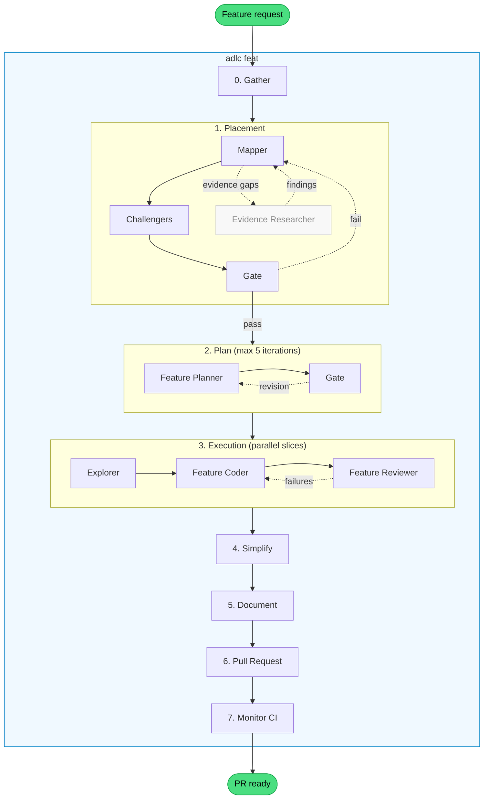
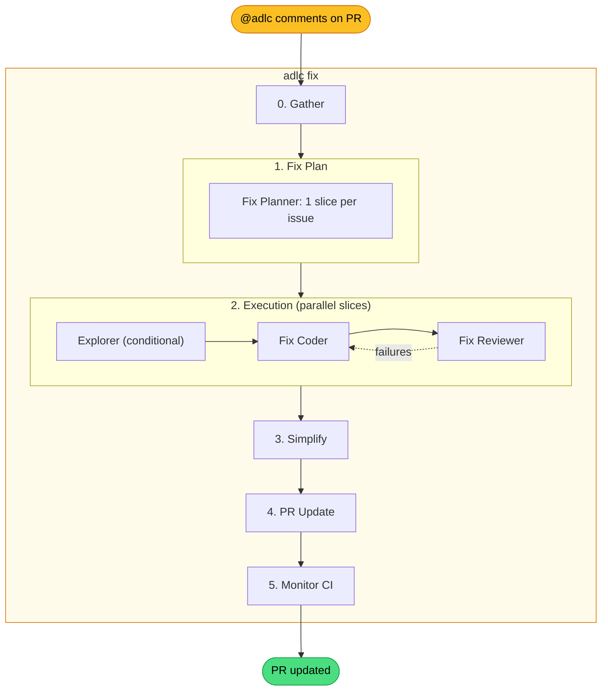

# ADLC

A headless CLI that plans, implements, and ships features using a multi-agent pipeline. Built on the [Claude Agent SDK](https://docs.anthropic.com/en/docs/claude-code/sdk), it orchestrates twenty-three agents through an Agent Development Life Cycle (ADLC) — from domain mapping to PR creation — with parallel slice execution via git worktrees.

## What is an agent harness?

An agent harness enhances the agent's natural capabilities instead of micromanaging each step. **Skills** define _what_ to do; **hooks** enforce _how well_ — running whether the agent remembers or not. Design based on the [Agent Harness](https://medium.com/@bijit211987/agent-harness-b1f6d5a7a1d1) article:

| #   | Principle                                  | Implementation                                                              |
| --- | ------------------------------------------ | --------------------------------------------------------------------------- |
| 1   | Verification is not optional               | SubagentStop hooks, pre-commit guards, tool guards                          |
| 2   | Context should be delivered, not requested | Project context preamble, reference doc injection                           |
| 3   | Supervision must be real-time              | Supervisor policies (wall-clock, test-thrash, browser-thrash, install-gate) |

---

## Workflows

ADLC has two workflows: **feature** (plan and implement from scratch) and **fix** (address issues flagged during PR review). Both share the same execution engine — parallel slice execution via git worktrees with coder/reviewer loops.

### Feature workflow (`adlc feat`)

The full 7-step pipeline for implementing a new feature from a description or GitHub issue.



### Fix workflow (`adlc fix`)

A lighter 5-step pipeline for addressing issues flagged via `@adlc` comments on an existing PR. Skips placement and documentation — the code already exists, fixes are scoped corrections.

**Flag phase:** Comment `@adlc <description>` on a PR. A GitHub Action creates a labeled issue (`adlc-fix`) linked to the PR. Multiple flags can accumulate.

**Fix phase:** Run `adlc fix --pr <PR#>`. The gather agent collects all open `adlc-fix` issues linked to the PR, generates one slice per issue, and runs them through the standard coder/reviewer loop on the existing PR branch.



### Key differences

| Aspect        | Feature (`adlc feat`)                                              | Fix (`adlc fix`)                                                   |
| ------------- | ------------------------------------------------------------------ | ------------------------------------------------------------------ |
| Input         | Text description or `--issue <N>`                                  | Text description or `--pr <N>` (issues auto-gathered)              |
| Gather        | Writes input file (text) or fetches GitHub issue (agent)           | Writes input file (text) or fetches linked adlc-fix issues (agent) |
| Placement     | Domain mapping + gate                                              | Skipped                                                            |
| Planning      | Feature planner + gate + challenge                                 | Fix planner (1:1 issue-to-slice)                                   |
| Execution     | `feature-slice-coordinator` + `feature-coder` + `feature-reviewer` | `fix-slice-coordinator` + `fix-coder` + `fix-reviewer`             |
| Documentation | Updates reference docs                                             | Skipped                                                            |
| PR            | Creates new PR                                                     | Appends fix section to existing PR                                 |
| Steps         | 8 (0–7)                                                            | 6 (0–5)                                                            |

---

Slices declare dependencies in their plan files. Independent slices run in parallel — each in its own git worktree with isolated `.adlc/` state and branch. Dev servers pick available ports dynamically. After completion, results merge back to the feature branch sequentially.

All inter-agent coordination goes through files in `.adlc/` — plan-header, slices, verification-results, implementation-notes, domain-mapping. This makes handoffs explicit and debuggable.

## Agents

Twenty-three agents form the pipeline. Each is defined as a markdown file with YAML frontmatter in [`agents/`](agents/), loaded at runtime by `src/workflow/agents.ts`.

| Agent                       | Workflow | What it does                                                                            |
| --------------------------- | -------- | --------------------------------------------------------------------------------------- |
| `gather`                    | both     | Fetches input from a PM tool (GitHub) and writes a structured input file (Haiku agent)  |
| `placement-coordinator`     | feat     | Orchestrates placement mapping: mapper, evidence, challenge team, and gate              |
| `domain-mapper`             | feat     | Analyzes feature terms against existing modules, writes placement decisions             |
| `evidence-researcher`       | feat     | Resolves mapper evidence gaps by inspecting code artifacts                              |
| `placement-gate`            | feat     | Holistic quality gate — reviews the entire mapping for architectural coherence          |
| `sprawl-challenger`         | feat     | Challenges create decisions with concrete extension proposals                           |
| `cohesion-challenger`       | feat     | Checks extend decisions for god-module risk                                             |
| `challenge-arbiter`         | feat     | Synthesizes challenger debate into unified verdict                                      |
| `plan-coordinator`          | feat     | Orchestrates plan drafting: feature-planner and plan-gate review loop                   |
| `feature-planner`           | feat     | Drafts a multi-slice plan with acceptance criteria per slice                            |
| `plan-gate`                 | feat     | Structural review gate — flags wrong boundaries, missing denormalization, weak criteria |
| `fix-planner`               | fix      | Generates one fix slice per GitHub issue — scoped corrections, no gate                  |
| `feature-slice-coordinator` | feat     | Orchestrates slice execution: explorer, coder, and reviewer retry loop                  |
| `fix-slice-coordinator`     | fix      | Orchestrates fix slice execution: conditional explorer, fix-coder/fix-reviewer loop     |
| `explorer`                  | both     | Surveys reference packages for a slice, returns patterns summary for the coder          |
| `feature-coder`             | feat     | Implements a single slice — code, MSW handlers, Storybook stories                       |
| `feature-reviewer`          | feat     | Verifies acceptance criteria via Storybook stories and host app sanity checks           |
| `fix-coder`                 | fix      | Fixes a single issue — fewer skills, updates existing stories instead of creating new   |
| `fix-reviewer`              | fix      | Verifies fix criteria via host app first, conditional Storybook and dark mode           |
| `simplify`                  | both     | Reviews changed code for reuse, quality, and efficiency, then fixes issues              |
| `document`                  | feat     | Updates module docs and architecture references to reflect what was built               |
| `pr`                        | both     | Creates new PR (feat) or appends fix section to existing PR (fix)                       |
| `monitor`                   | both     | Polls CI workflows, auto-fixes failures (lint, Chromatic, Lighthouse)                   |

---

## Principle 1: Verification is not optional

Every subagent is verified by hooks before the workflow advances. The agent cannot skip verification — it's infrastructure, not instructions.

Hooks fall into four categories: **verificators** that block completion until checks pass, **context refreshers** that surface easy-to-forget concerns at stop time, **autofixers** that correct issues before validation, and **guards** that enforce constraints on every tool call. If any check fails, the problems are fed back to the agent for correction — not reported as a final failure.

### Validators ([README](src/hooks/post-agent-checks/README.md))

Block a subagent's completion until its deliverables meet structural and quality checks.

| Agent                               | Checks                                                                                                                                                                                                                     |
| ----------------------------------- | -------------------------------------------------------------------------------------------------------------------------------------------------------------------------------------------------------------------------- |
| `feature-coder` / `fix-coder`       | build, lint (linter + formatter + typecheck + syncpack + knip), tests (Vitest + Storybook a11y), no-file-disable, no-secrets (gitleaks), import-guard (4-layer boundary enforcement), implementation-notes, story-coverage |
| `feature-planner`                   | plan-header exists, at least one slice file, every slice has `- [ ]` acceptance criteria and a Reference Packages section                                                                                                  |
| `plan-gate`                         | no plan file mutations (read-only review), revision must reference specific slices with evidence                                                                                                                           |
| `domain-mapper`                     | mapping file exists, every medium+ confidence challenge has a resolution entry                                                                                                                                             |
| `evidence-researcher`               | evidence findings file exists                                                                                                                                                                                              |
| `placement-gate`                    | no plan file mutations, revision must contain `ISSUE` blocks                                                                                                                                                               |
| `feature-reviewer` / `fix-reviewer` | verification results exist, results cover every acceptance criterion from the slice                                                                                                                                        |

### Context refreshers

Block once per slice with a concise checklist — forcing attention on concerns that are easy to forget after thousands of tokens. Currently: `feature-coder` and `fix-coder` get reminded about MSW handlers, story variants, and implementation notes (keyed by slice name via `.adlc/markers.json`).

### Autofixers

`format-fix` and `lint-fix` run automatically before validation for `feature-coder`, `fix-coder`, `simplify`, and `document`. Formatting violations never surface as failures.

### Run metrics

On every agent completion, the SubagentStop hook parses the agent's transcript JSONL and appends a run entry to `.adlc/run-metrics.json`. Each entry includes token breakdown (input, output, cache read, cache creation), per-tool use counts, wall time, and timestamps.

### Guards ([README](src/hooks/guards/README.md))

Constraints that apply to every tool call, regardless of which agent is running.

| Guard                     | Trigger          | What it does                                                                    |
| ------------------------- | ---------------- | ------------------------------------------------------------------------------- |
| `block-npm`               | Bash             | Blocks `npm`, `npx`, `pnpx`, `pnpm dlx` — only `pnpm` allowed                   |
| `block-windows-cmd`       | Bash             | Blocks `cmd` / `cmd.exe` invocations on Windows                                 |
| `block-node-modules-read` | Bash, Read, Glob | Blocks reading `node_modules` source (`.d.ts` type definitions are allowed)     |
| `block-env-write`         | Edit, Write      | Blocks modifications to `.env` and `.env.*` files — secrets must not be touched |
| `agent-browser-rewrite`   | Bash             | Rewrites bare `agent-browser` to `pnpm exec agent-browser`                      |

### Pre-commit gate ([README](src/hooks/pre-commit/README.md))

| Hook         | Trigger      | What it does                                                                                                             |
| ------------ | ------------ | ------------------------------------------------------------------------------------------------------------------------ |
| `pre-commit` | `git commit` | Intercepts commits — runs format-fix + lint-fix, then build + lint + tests + gitignore-check in parallel before allowing |

## Principle 2: Context should be delivered, not requested

At the start of every run, the orchestrator builds a project context preamble and injects it into every agent prompt:

- **Commands** — standardized scripts from the root `package.json` (`build`, `lint`, `test`, `dev-app`, etc.)
- **Reference docs** — classified catalog of docs from `./agent-docs/` (see below)
- **Structure** — repo layout, paths, license, and author

Agents start with full context rather than burning tokens on exploratory tool calls.

### Reference doc classification

The consumer drops markdown files in `./agent-docs/` with whatever naming and folder structure they want. At startup, ADLC discovers every `.md` file, extracts its title, and runs a lightweight Haiku classifier agent that maps each file to one of ten semantic categories:

| Category       | What it covers                                |
| -------------- | --------------------------------------------- |
| `architecture` | Repo structure, system design                 |
| `adr`          | Architectural decision records                |
| `operations`   | Operational decisions, CI/CD                  |
| `placement`    | Code placement rules, module responsibilities |
| `api`          | Data layer, MSW, TanStack Query               |
| `storybook`    | Story conventions, decorators                 |
| `components`   | Component library (shadcn/ui)                 |
| `styling`      | Tailwind, PostCSS, color modes                |
| `browser`      | Browser testing, agent-browser                |
| `design`       | UI/UX design principles                       |

The result is a lookup table — `category → [file paths]` — embedded in the preamble. Agent prompts reference docs by category name (`"read the placement reference doc"`), never by path. This decouples agent logic from the consumer's file structure: rename or reorganize `agent-docs/` freely, the classifier re-maps on the next run.

If the classifier agent is unavailable, regex heuristics produce the same mapping as a fallback.

## Principle 3: Supervision must be real-time

The supervisor observes tool calls in real time during execution — not just at agent completion. Stateful policies detect waste as it happens and interrupt before the budget is spent. ([README](src/hooks/supervisor/README.md))

| Policy           | What it detects                | Response                                                                                                                |
| ---------------- | ------------------------------ | ----------------------------------------------------------------------------------------------------------------------- |
| `wall-clock`     | Agent running too long         | Nudge at threshold, hard stop at limit. Per-agent thresholds.                                                           |
| `browser-thrash` | Browser stuck loops            | Dual detection: density (cross-page spirals) + repetition (same-page probing). Tiered recovery gates. Total budget cap. |
| `test-thrash`    | Test reruns without code edits | Edit-gap detection with tiered recovery. Requires code changes between test runs.                                       |
| `install-gate`   | Blind `pnpm install`           | Blocks unless manifests changed, an override exists, or a PostToolUse dependency failure grants a one-shot bypass.      |

State is in-memory per agent run. `PostToolUse` events can unlock narrow recovery paths (e.g., a one-shot `pnpm install` bypass after a real missing-dependency failure).

---

## Embedded skills

Skills shipped with the package that agents load at runtime for scaffolding and validation.

| Skill                | What it does                                                                                     |
| -------------------- | ------------------------------------------------------------------------------------------------ |
| `agent-browser`      | Browser automation CLI for navigating pages, filling forms, taking screenshots, testing web apps |
| `browser-recovery`   | Recovery process for agents stuck in browser interaction loops (loaded by supervisor)            |
| `scaffold-module`    | Scaffolds a new Squide module or subfolder — files, host registration, Storybook wiring          |
| `scaffold-storybook` | Scaffolds a module-scoped Storybook with Chromatic CI integration                                |
| `validate-modules`   | Validates module structure and wiring (files, exports, host registration, Storybook)             |
| `workleap-logging`   | Guide for @workleap/logging — structured logging, composable loggers, scopes, log levels         |
| `workleap-squide`    | Reference skill for Squide's FireflyRuntime, AppRouter, and modular shell patterns               |
| `workleap-telemetry` | Guide for @workleap/telemetry — OpenTelemetry traces, spans, and integration patterns            |

Scaffolding skills use a **reference module pattern** — instead of hardcoding versions or configs, they read a canonical module at runtime and clone from it.

## Conventions and assumed dependencies

The orchestrator is built for **pnpm monorepos** using the [Squide](https://github.com/gsoft-inc/wl-squide) modular application shell. It assumes the following conventions in the target repository.

### Package scopes

| Layer    | Scope       | Example                                    |
| -------- | ----------- | ------------------------------------------ |
| Apps     | `@apps`     | `@apps/host`, `@apps/storybook`            |
| Modules  | `@modules`  | `@modules/management`, `@modules/watering` |
| Packages | `@packages` | `@packages/components`, `@packages/api`    |

### Expected repo structure

```
apps/
  host/                        # Thin shell — bootstraps Squide, no feature logic
  storybook/                   # Unified Storybook — all stories
  storybook-<module>/          # Per-module Storybook
modules/
  <module>/                    # Feature module (@modules/<name>)
packages/
  <package>/                   # Shared package (@packages/<name>)
```

Modules are fully isolated — modules never import from each other. Each has its own Storybook and Chromatic token for independent visual regression testing.

### Required root scripts

The orchestrator validates these scripts at startup: `build`, `lint`, `test`, `typecheck`, `lint-check`, `lint-fix`, `format-check`, `format-fix`, `knip`, `syncpack`, `dev-app`, `dev-storybook`.

### Required tools

[pnpm](https://pnpm.io), [GitHub CLI](https://cli.github.com) (`gh`), [Squide](https://github.com/gsoft-inc/wl-squide), [Storybook](https://storybook.js.org) + [Chromatic](https://www.chromatic.com), [agent-browser](https://www.npmjs.com/package/agent-browser) (devDependency — invoked via `pnpm exec`).

## Installation

### Prerequisites

- Node.js 23.6+
- pnpm
- [Claude Code](https://docs.anthropic.com/en/docs/claude-code) CLI (the Agent SDK runs under Claude Code)

The Agent SDK requires the experimental agent teams flag. Add this to your `.claude/settings.json`:

```json
{
    "env": {
        "CLAUDE_CODE_EXPERIMENTAL_AGENT_TEAMS": "1"
    }
}
```

### Install the package

```bash
pnpm add @patlaf/adlc
```

## Usage

### Implement a new feature

```bash
# From a text description
pnpm adlc feat "Add a household feature with member invitations and plant sharing"

# From a GitHub issue
pnpm adlc feat --issue 52
```

### Preview the execution plan

```bash
pnpm adlc feat --dry-run "Add household feature"
pnpm adlc feat --dry-run --issue 52
```

### Fix issues on an existing PR

Flag issues during review by commenting `@adlc <description>` on the PR. Each comment creates a GitHub issue labeled `adlc-fix`. Then batch-fix all flagged issues:

```bash
# From GitHub (auto-gathers linked adlc-fix issues)
pnpm adlc fix --pr 42

# From a text description
pnpm adlc fix 42 "Issue #51: Fix color..."
```

### CLI reference

```
Usage:
  adlc feat [options] <description>         Text mode
  adlc feat [options] --issue <N>            GitHub issue mode
  adlc fix  [options] <pr#> <description>    Text mode
  adlc fix  [options] --pr <N>               GitHub PR mode

Commands:
  feat    Plan and implement a new feature
  fix     Fix issues flagged on an existing PR

Options:
  --issue <N>         Fetch input from a GitHub issue (feat only)
  --pr <N>            Fetch linked adlc-fix issues from a GitHub PR (fix only)
  --dry-run           Show wave schedule without executing
  -h, --help          Show this help message
```

## Configuration

The `adlc.config.ts` file in the target repository customizes the orchestrator:

```typescript
import { defineConfig } from "@patlaf/adlc";

export default defineConfig({
    structure: {
        apps: "./apps", // default
        hostApp: "host", // default
        modules: "./modules", // default
        packages: "./packages", // default
        reference: "./agent-docs" // default — where reference docs live
    },
    scaffolding: {
        packageMeta: {
            license: "Apache-2.0", // default
            author: "Your Name"
        },
        referenceModule: "modules/management",
        referenceStorybook: "apps/storybook-management"
    },
    agents: {
        "feature-coder": {
            skills: ["accessibility"] // extra skills resolved to .claude/skills/{name}/SKILL.md
        }
    }
});
```
