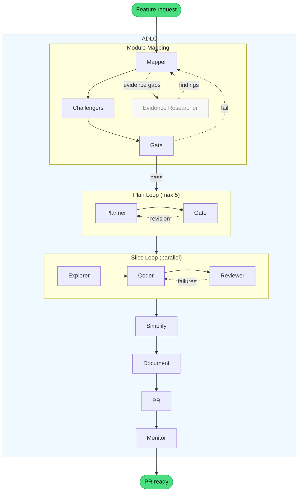

# ADLC Harness

A headless CLI that plans, implements, and ships features using a multi-agent pipeline. Built on the [Claude Agent SDK](https://docs.anthropic.com/en/docs/claude-code/sdk), it orchestrates fifteen agents through an Agent Development Life Cycle (ADLC) — from domain mapping to PR creation — with parallel slice execution via git worktrees.

## What is an agent harness?

An agent harness enhances the agent's natural capabilities instead of micromanaging each step. Rather than scripting every tool call, it provides two complementary layers:

- **Skills** define _what_ to do — lightweight orchestration that tells the agent where to go next
- **Hooks** enforce _how well_ — automated verification, autofix, and context delivery that runs whether the agent remembers or not

### Design principles

This design is based on three principles from the [Agent Harness](https://medium.com/@bijit211987/agent-harness-b1f6d5a7a1d1) article:

| # | Principle | Implementation |
|---|-----------|----------------|
| 1 | Verification is not optional | SubagentStop hooks, pre-commit guards, tool guards |
| 2 | Context should be delivered, not requested | Project context preamble, reference doc injection |
| 3 | Supervision must be real-time | Supervisor policies (wall-clock, test-thrash, browser-thrash, install-gate) |

---

## Pipeline



Slices declare dependencies in their plan files. Independent slices run in parallel — each in its own git worktree with isolated `.adlc/` state, ports, and branch. After completion, results merge back to the feature branch sequentially.

All inter-agent coordination goes through files in `.adlc/` — plan-header, slices, verification-results, implementation-notes, domain-mapping. This makes handoffs explicit and debuggable.

## Agents

Fifteen agents form the pipeline. Each is defined as a markdown file with YAML frontmatter in [`agents/`](agents/), loaded at runtime by `src/workflow/agents.ts`.

| Agent | What it does |
|-------|-------------|
| `domain-mapper` | Analyzes feature terms against existing modules, writes placement decisions |
| `evidence-researcher` | Resolves mapper evidence gaps by inspecting code artifacts |
| `placement-gate` | Holistic quality gate — reviews the entire mapping for architectural coherence |
| `sprawl-challenger` | Challenges create decisions with concrete extension proposals |
| `cohesion-challenger` | Checks extend decisions for god-module risk |
| `challenge-arbiter` | Synthesizes challenger debate into unified verdict |
| `planner` | Drafts a multi-slice plan with acceptance criteria per slice |
| `plan-gate` | Structural review gate — flags wrong boundaries, missing denormalization, weak criteria |
| `explorer` | Surveys reference packages for a slice, returns patterns summary for the coder |
| `coder` | Implements a single slice — code, MSW handlers, Storybook stories |
| `reviewer` | Verifies acceptance criteria via browser screenshots and interactions |
| `simplify` | Reviews changed code for reuse, quality, and efficiency, then fixes issues |
| `document` | Updates module docs and architecture references to reflect what was built |
| `pr` | Pushes branch, opens PR with summary and technical changes |
| `monitor` | Polls CI workflows, auto-fixes failures (lint, Chromatic, Lighthouse) |

---

## Principle 1: Verification is not optional

Every subagent is verified by hooks before the workflow advances. The agent cannot skip verification — it's infrastructure, not instructions.

Hooks fall into four categories: **verificators** that block completion until checks pass, **context refreshers** that surface easy-to-forget concerns at stop time, **autofixers** that correct issues before validation, and **guards** that enforce constraints on every tool call. If any check fails, the problems are fed back to the agent for correction — not reported as a final failure.

### Verificators ([README](src/hooks/post-agent-checks/README.md))

Block a subagent's completion until its deliverables meet structural and quality checks.

| Agent | Check | What it validates |
|-------|-------|-------------------|
| `coder` | build | Full monorepo build |
| `coder` | lint | Full monorepo lint — linter, formatter, typecheck, syncpack, knip |
| `coder` | tests | Full monorepo tests — Vitest + Storybook a11y via Playwright |
| `coder` | no-file-disable | Rejects file-level `/* oxlint-disable */` comments (line-level only) |
| `coder` | no-secrets | gitleaks scan on changed files |
| `coder` | import-guard | 4-layer architectural boundary enforcement (host > modules > packages) |
| `coder` | implementation-notes | A file in `.adlc/implementation-notes/` must be created or updated |
| `coder` | story-coverage | Every changed component in a module needs a matching `.stories.tsx` |
| `planner` | plan-header | `.adlc/plan-header.md` must exist and be non-empty |
| `planner` | slice-files | At least one `.md` file in `.adlc/slices/` |
| `planner` | slice-criteria | Every slice must have `- [ ]` acceptance criteria |
| `planner` | slice-ref-packages | Every slice must have a Reference Packages section |
| `plan-gate` | no-plan-mutations | Must not modify plan files (read-only review) |
| `plan-gate` | revision-slice-refs | Revision must reference specific slices with evidence |
| `domain-mapper` | mapping-file | `.adlc/domain-mapping.md` must exist |
| `domain-mapper` | engagement-check | Every medium+ confidence challenge has a resolution entry |
| `evidence-researcher` | evidence-findings | `.adlc/current-evidence-findings.md` must exist |
| `placement-gate` | no-plan-mutations | Must not modify plan files |
| `placement-gate` | revision-issues | If revision exists, must contain `ISSUE` blocks |
| `reviewer` | verification-results | `.adlc/verification-results.md` must exist |
| `reviewer` | criteria-coverage | Results must cover every acceptance criterion from the slice |

### Context refreshers

By the time a subagent reaches completion, its original instructions are buried under thousands of tokens of code and tool output. Context refreshers block once per slice with a concise checklist — forcing recency-bias attention on concerns that are easy to forget.

| Agent | Refresh | What it reminds |
|-------|---------|-----------------|
| `coder` | context-refresh | MSW handlers, story variants, implementation notes |

Uses `.adlc/markers.json` keyed by slice name so the checklist fires once per slice — not on every stop attempt.

### Autofixers

Run corrections before validation to reduce noise. Formatting violations never appear as failures.

| Agent | Autofix | What it does |
|-------|---------|-------------|
| `coder` | format-fix | `pnpm format-fix` before lint phase |
| `coder` | lint-fix | `pnpm lint-fix` after format, before lint check |
| `simplify` | format-fix | `pnpm format-fix` before lint phase |
| `simplify` | lint-fix | `pnpm lint-fix` after format, before lint check |
| `document` | format-fix | `pnpm format-fix` after doc updates |
| `document` | lint-fix | `pnpm lint-fix` after format |

### Run metrics

On every agent completion, the SubagentStop hook parses the agent's transcript JSONL and appends a run entry to `.adlc/run-metrics.json`. Each entry includes token breakdown (input, output, cache read, cache creation), per-tool use counts, wall time, and timestamps.

### Guards ([README](src/hooks/guards/README.md))

Constraints that apply to every tool call, regardless of which agent is running.

| Guard | Trigger | What it does |
|-------|---------|-------------|
| `block-npm` | Bash | Blocks `npm`, `npx`, `pnpx`, `pnpm dlx` — only `pnpm` allowed |
| `block-windows-cmd` | Bash | Blocks `cmd` / `cmd.exe` invocations on Windows |
| `block-node-modules-read` | Bash, Read, Glob | Blocks reading `node_modules` source (`.d.ts` type definitions are allowed) |
| `block-env-write` | Edit, Write | Blocks modifications to `.env` and `.env.*` files — secrets must not be touched |
| `agent-browser-rewrite` | Bash | Rewrites bare `agent-browser` to `pnpm exec agent-browser` |

### Pre-commit gate ([README](src/hooks/pre-commit/README.md))

| Hook | Trigger | What it does |
|------|---------|-------------|
| `pre-commit` | `git commit` | Intercepts commits — runs format-fix + lint-fix, then build + lint + tests in parallel before allowing |
| `gitignore-guard` | `git commit` | Blocks commits that add `!.adlc/` negation patterns to `.gitignore` |

## Principle 2: Context should be delivered, not requested

Agents shouldn't spend tool calls searching for information they will inevitably need. At the start of every run, the orchestrator builds a project context preamble from the target repository and injects it into every agent prompt:

- **Commands** — discovers standardized scripts (`build`, `lint`, `test`, `dev-app`, etc.) from the root `package.json` so agents know the exact commands to run
- **Reference docs** — recursively scans the reference directory (default `./agent-docs/`), extracts titles, then classifies each doc into semantic categories (architecture, placement, API patterns, Storybook, styling, etc.) using a lightweight agent — with filename heuristics as fallback
- **Structure** — injects the repo layout (apps, modules, packages paths), license, and author so agents place code correctly without exploring first

The result: agents start with full context rather than burning tokens on `ls`, `cat`, and `find` calls to orient themselves.

## Principle 3: Supervision must be real-time

The supervisor observes tool calls in real time during execution — not just at agent completion. Stateful policies detect waste as it happens and interrupt before the budget is spent. ([README](src/hooks/supervisor/README.md))

| Policy | What it detects | Response |
|--------|----------------|----------|
| `wall-clock` | Agent running too long | Nudge at threshold, hard stop at limit. Per-agent thresholds. |
| `browser-thrash` | Browser stuck loops | Dual detection: density (cross-page spirals) + repetition (same-page probing). Tiered recovery gates. Total budget cap. |
| `test-thrash` | Test reruns without code edits | Edit-gap detection with tiered recovery. Requires code changes between test runs. |
| `install-gate` | Blind `pnpm install` | Blocks unless manifests changed, an override exists, or a PostToolUse dependency failure grants a one-shot bypass. |

State is in-memory — shared across all tool calls within a single agent run, no disk I/O. The supervisor also consumes `PostToolUse` events so command-result evidence can unlock narrow recovery paths (e.g., a one-shot `pnpm install` bypass after a real missing-dependency failure).

---

## Embedded skills

Skills shipped with the package that agents load at runtime for scaffolding and validation.

| Skill | What it does |
|-------|-------------|
| `agent-browser` | Browser automation CLI for navigating pages, filling forms, taking screenshots, testing web apps |
| `browser-recovery` | Recovery process for agents stuck in browser interaction loops (loaded by supervisor) |
| `scaffold-module` | Scaffolds a new Squide module or subfolder — files, host registration, Storybook wiring |
| `scaffold-storybook` | Scaffolds a module-scoped Storybook with Chromatic CI integration |
| `validate-modules` | Validates module structure and wiring (files, exports, host registration, Storybook) |
| `workleap-logging` | Guide for @workleap/logging — structured logging, composable loggers, scopes, log levels |
| `workleap-squide` | Reference skill for Squide's FireflyRuntime, AppRouter, and modular shell patterns |
| `workleap-telemetry` | Guide for @workleap/telemetry — OpenTelemetry traces, spans, and integration patterns |

Scaffolding skills use a **reference module pattern** — instead of hardcoding versions or configs, they read a canonical module at runtime and clone from it.

## Conventions and assumed dependencies

The orchestrator is built for **pnpm monorepos** using the [Squide](https://github.com/gsoft-inc/wl-squide) modular application shell. It assumes the following conventions in the target repository.

### Package scopes

| Layer | Scope | Example |
|-------|-------|---------|
| Apps | `@apps` | `@apps/host`, `@apps/storybook` |
| Modules | `@modules` | `@modules/management`, `@modules/watering` |
| Packages | `@packages` | `@packages/components`, `@packages/api` |

### Expected repo structure

```
apps/
  host/                        # Thin shell — bootstraps Squide, no feature logic
  storybook/                   # Unified Storybook — all stories
  storybook-<module>/          # Per-module Storybook
modules/
  <module>/                    # Feature module (@modules/<name>)
packages/
  <package>/                   # Shared package (@packages/<name>)
```

Modules are fully isolated — modules never import from each other. Each has its own Storybook and Chromatic token for independent visual regression testing.

### Required root scripts

The orchestrator validates that these scripts exist in the target repo's `package.json` at startup:

`build`, `lint`, `test`, `typecheck`, `lint-check`, `lint-fix`, `format-check`, `format-fix`, `knip`, `syncpack`, `dev-app`, `dev-storybook`

### Required binaries

`agent-browser` — must be installed as a devDependency (agents invoke it directly via `pnpm exec`)

### Tech stack

The orchestrator assumes and leverages these tools:

| Tool | Purpose |
|------|---------|
| [pnpm](https://pnpm.io) | Package manager |
| [Squide](https://github.com/gsoft-inc/wl-squide) | Modular application shell |
| [Storybook](https://storybook.js.org) + [chromatic](https://www.chromatic.com) | Visual regression testing |
| [agent-browser](https://www.npmjs.com/package/agent-browser) | Browser automation |

## Installation

### Prerequisites

- Node.js 23.6+
- pnpm
- [Claude Code](https://docs.anthropic.com/en/docs/claude-code) CLI (the Agent SDK runs under Claude Code)

The Agent SDK requires the experimental agent teams flag. Add this to your `.claude/settings.json`:

```json
{
    "env": {
        "CLAUDE_CODE_EXPERIMENTAL_AGENT_TEAMS": "1"
    }
}
```

### Install the package

```bash
pnpm add @patlaf/adlc
```

### Initialize a target repo

In the repository where you want to run the harness:

```bash
pnpm adlc init
```

This creates an `adlc.config.ts` scaffold:

```typescript
import { defineConfig } from "@patlaf/adlc";

export default defineConfig({});
```

## Usage

### Run the full pipeline

```bash
pnpm adlc "Add a household feature with member invitations and plant sharing"
```

### Preview the execution plan

```bash
pnpm adlc --dry-run "Add household feature"
```

### CLI reference

```
Usage: adlc [options] <feature-description>
       adlc init

Commands:
  init                Scaffold adlc.config.ts if not present

Options:
  --dry-run           Show wave schedule without executing
  --verbose           Show full agent output instead of progress summary
  -h, --help          Show this help message
```

## Configuration

The `adlc.config.ts` file in the target repository customizes the orchestrator:

```typescript
import { defineConfig } from "@patlaf/adlc";

export default defineConfig({
    structure: {
        apps: "./apps",           // default
        hostApp: "host",          // default
        modules: "./modules",     // default
        packages: "./packages",   // default
        reference: "./agent-docs" // default — where reference docs live
    },
    scaffolding: {
        packageMeta: {
            license: "Apache-2.0", // default
            author: "Your Name"
        },
        referenceModule: "modules/management",
        referenceStorybook: "apps/storybook-management"
    },
    ports: {
        storybook: 6100, // base port — offset per worktree
        hostApp: 8100,
        browser: 9200
    },
    agents: {
        coder: {
            skills: ["accessibility"] // extra skills resolved to .claude/skills/{name}/SKILL.md
        }
    }
});
```
